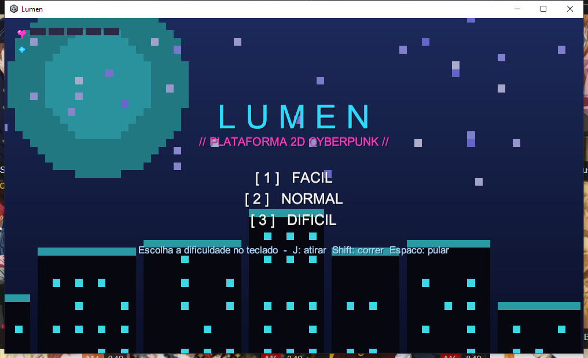
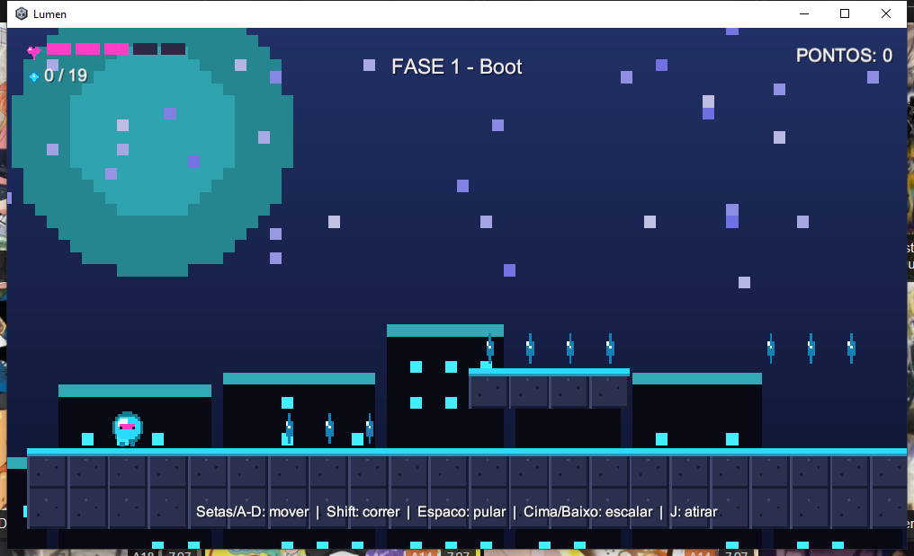
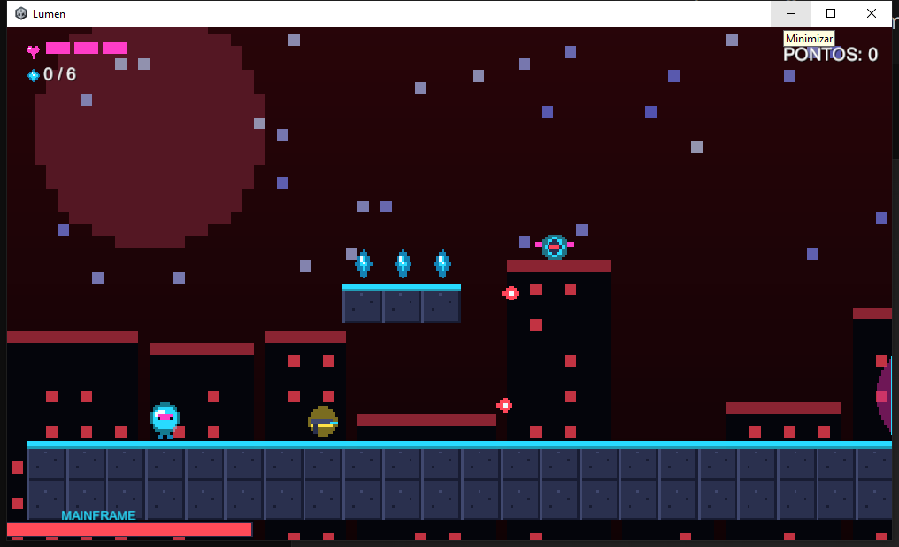

# 🌆 Lumen - Plataforma 2D Cyberpunk

> Projeto da disciplina **Game Development** - UniFECAF
> Desenvolvido em **Unity 6 (6000.4)** com **C#** por **Samuel Nunes**

**Lumen** é um jogo de plataforma 2D de estética **cyberpunk** (neon synthwave). Você controla
um pequeno *netrunner* de luz que precisa atravessar os níveis de uma megacidade subterrânea:
saltando por abismos, escalando, coletando **data-shards**, pegando **armas** para atirar em
**drones** e bots de segurança - até enfrentar o **MAINFRAME**, o chefe final, numa arena.
Cada fase tem um **céu de cor diferente** que pulsa em neon conforme você avança.





---

## 🎮 Mecânicas

- **Andar** e **correr** (movimento horizontal responsivo)
- **Pular** (com *coyote time*, *jump buffer* e altura variável - sensação de controle "justo")
- **Escalar** cipós/escadas (a gravidade é desativada enquanto agarrado)
- **Atirar** - pegue uma **arma** (dropada por inimigos ou espalhada nas fases) e dispare projéteis neon
- **Pisar** em inimigos para derrotá-los
- **Drones voadores** e bots de segurança como inimigos
- **Chefe final (MAINFRAME)** com barra de vida própria, que se move e atira
- **Coletar** data-shards que valem pontos
- **Barra de vida** segmentada (com **corações** que aumentam a vida); ao cair no abismo você renasce; ao zerar a vida, é Game Over
- **Menu inicial** com seleção de **dificuldade** (Fácil / Normal / Difícil)
- **Céu dinâmico** que muda de cor por fase e pisca em neon

## ⌨️ Controles

| Ação | Tecla |
|---|---|
| Escolher dificuldade (menu) | `1` `2` `3` |
| Mover | `←` `→` ou `A` `D` |
| Correr | segurar `Shift` |
| Pular | `Espaço`, `W` ou `↑` |
| Escalar (em escadas) | `↑` `↓` ou `W` `S` |
| **Atirar** | `J` ou clique esquerdo |
| Reiniciar (após Game Over / Vitória) | `R` |
| Ativar/desativar som | `M` |
| Sair (no executável) | `Esc` |

## 🗺️ Fases

São **5 fases** com dificuldade crescente:

1. **Boot** - tutorial em terreno plano; primeira arma e drone.
2. **Submundo** - abismos para pular, espinhos e escalada obrigatória.
3. **Arranha-Céu** - verticalidade, drones e uma torre de escalada longa.
4. **O Núcleo** - combina todos os desafios em densidade máxima.
5. **MAINFRAME** - arena do **chefe final**: pegue armas, desvie dos tiros e destrua o boss.

---

## ▶️ Como jogar

### Opção 1 - Executável (Windows)
1. Baixe/extraia a pasta `Build/`.
2. Execute **`Lumen.exe`**.

### Opção 2 - No editor Unity
1. Abra o projeto no **Unity 6 (6000.4.11f1)** via Unity Hub (*Add project from disk*).
2. Abra a cena `Assets/Scenes/SampleScene.unity`.
3. Pressione **Play**.

> O jogo é **dirigido por código**: ao iniciar a cena, a classe `Bootstrap` constrói
> automaticamente todo o jogo (personagem, fases, HUD, áudio). Não é preciso montar nada
> manualmente no editor.

## 🛠️ Como exportar (Build)

`File → Build Settings → Windows → Build` e escolha uma pasta (ex.: `Build/`).
A cena `SampleScene` já está incluída na build.

---

## 🧩 Arquitetura técnica

O jogo NÃO usa assets externos: **toda a arte (sprites) e todo o áudio (trilha + efeitos)
são gerados proceduralmente por código**, o que o torna 100% reprodutível.

| Script | Responsabilidade |
|---|---|
| `Bootstrap.cs` | Ponto de entrada (inicia o jogo ao carregar a cena) |
| `GameManager.cs` | Singleton: vidas, pontuação, fases, vitória/derrota |
| `PlayerController.cs` | Movimento (andar/correr/pular/escalar) e animação |
| `LevelData.cs` | Mapas das fases em texto (ASCII) |
| `LevelBuilder.cs` | Constrói a fase a partir do mapa |
| `Enemy.cs` | Inimigo terrestre/drone voador (com pisão e drop de arma) |
| `Boss.cs` | Chefe final (vida, movimento, ataques) |
| `Projectile.cs` | Projétil neon (jogador e inimigos) |
| `WeaponPickup.cs` | Arma coletável (dá munição) |
| `Collectible.cs` | Data-shard coletável |
| `Hazard.cs` | Espinhos de energia (dano) |
| `Ladder.cs` | Marcador de escada |
| `LevelExit.cs` | Portal de saída da fase |
| `HUDController.cs` | Interface (barra de vida, cristais, munição, barra do chefe) |
| `AudioManager.cs` | Síntese de áudio (chiptune/SFX) |
| `SpriteFactory.cs` | Geração procedural de sprites (pixel art cyberpunk) |
| `SpriteAnimator.cs` | Animação por troca de quadros |
| `CameraFollow.cs` | Câmera que segue o jogador com limites |
| `SkyController.cs` | Flicker neon do céu/fundo |
| `Spark.cs` | Partícula de feedback visual |

## 📁 Estrutura do projeto

```
Lumen/
├── Assets/
│   ├── Scripts/        # todo o código C#
│   └── Scenes/         # SampleScene.unity (cena única)
├── Docs/
│   └── RELATORIO.pdf   # relatório teórico
├── Build/              # executável Windows (após o build)
└── README.md
```

## 🎨 Créditos

- **Arte e áudio:** originais, gerados proceduralmente pelo código do projeto.
- **Fonte do HUD:** fonte interna da Unity (`LegacyRuntime.ttf`).
- **Engine:** Unity 6 • **Linguagem:** C#.

---

*Projeto acadêmico - UniFECAF, 2026.*
